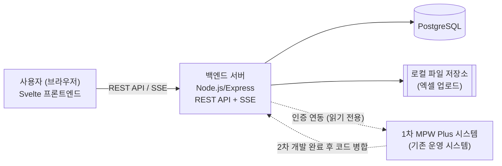

# MPW Plus 2차 개발 기술 아키텍처 다이어그램

> `docs/1-domain-definition.md`, `docs/2-PRD.md`, `docs/3-user-scenario.md`, `docs/project-structure-principles.md`에서 이미 확정된 내용을 그대로 전제로 한다. `project-structure-principles.md`가 라우트/컨트롤러/서비스/DB 등 상세 레이어와 리소스별 디렉토리를 다룬다면, 이 문서는 그보다 한 단계 위에서 전체 시스템 구성을 한눈에 보는 그림만 담는다.

## 아키텍처 다이어그램

## 구성요소

- **사용자 (브라우저)**: Svelte 프론트엔드. MapGen Web, 임가공 Plan, Master Page, Deliverables Page를 렌더링.
- **백엔드 서버**: Node.js/Express. REST API로 CRUD를 처리하고, SSE로 임가공 Plan/Master 변경사항을 실시간 브로드캐스트.
- **PostgreSQL**: 임가공 Plan, Deliverables 메타데이터, Master 항목 등 영속 데이터 저장.
- **로컬 파일 저장소**: Deliverables에 업로드되는 엑셀 파일 보관.
- **1차 MPW Plus 시스템**: 인증/권한 연동 대상이며, 2차 개발 완료 후 이 저장소의 코드가 병합될 기존 운영 시스템(도메인정의서 4·8절, PRD 5절 참조).
