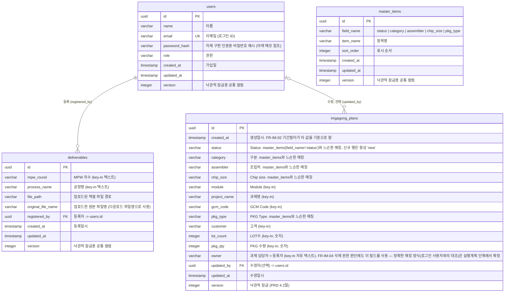

# MPW Plus 2차 개발 ERD (Entity-Relationship Diagram)

> `docs/2-PRD.md`(특히 3.5절 데이터 모델 초안, 4.2절 낙관적 잠금)와 `docs/4-project-structure-principles.md`(3절 코드/네이밍 원칙 — DB 네이밍 컨벤션)에서 이미 확정된 내용을 그대로 전제로 삼아 실제 테이블 스키마 수준으로 구체화한다. `docs/1-domain-definition.md`의 범위 정의도 함께 전제로 한다.
>
> 워크플로우상 위치: PRD(`2-PRD.md`) → 사용자 시나리오(`3-user-scenario.md`) → 구조설계 원칙(`4-project-structure-principles.md`) → 아키텍처 다이어그램(`5-arch-diagram.md`) 다음이며, 이후 진행될 실행계획/UI 설계보다 앞선 단계다.

## ERD

## 테이블별 근거

- **deliverables**: PRD FR-DL-01/02/03/04, 3.5절 데이터 모델("차수, 공정명, 파일경로, 등록일시, 등록자"). 같은 (mpw_round, process_name) 조합의 중복 등록을 허용해야 하므로(FR-DL-02 수용기준) 이 두 컬럼에는 유니크 제약을 두지 않는다.
- **imgagong_plans**: PRD FR-IM-01~06, 3.5절 데이터 모델. `version`은 PRD 4.2절 낙관적 잠금 요구사항을 직접 반영한다. `owner`는 "과제 담당자"이자 "등록자" 역할을 겸한다(같은 사람으로 결정됨 — 별도 `created_by` 컬럼을 두지 않는다).
- **master_items**: PRD FR-MS-01/02/03, 3.5절("필드명, 항목명, 순서로 구성된 범용 테이블"). 필드별로 테이블을 쪼개지 않고 `field_name` 컬럼으로 구분한다.
- **users**: PRD 3.5절("이름, 이메일, 권한, 가입일")과 5절(인증 방식 — 자체 구현을 1차 목표로 결정) 근거. `password_hash`는 자체 구현 인증을 위해 추가됐다. 아래 "users 테이블 관련 메모" 참조.

## 느슨한 참조 (FK 아님)

`imgagong_plans`의 `status` / `category` / `assembler` / `chip_size` / `pkg_type` 다섯 컬럼은 문자열 그대로 저장되며, `master_items`에서 같은 `field_name`으로 등록된 `item_name` 값 중 하나와 일치해야 한다는 애플리케이션 레벨 규칙만 있다. DB 레벨의 FK 제약은 걸지 않는다 — 프론트 프로토타입이 이미 단순 문자열 매칭 방식이고(`4-project-structure-principles.md` "단순성 우선" 원칙), 필드마다 참조 테이블을 쪼개면 5개의 테이블이 추가되는 과한 정규화이기 때문이다. 이 다이어그램에서도 이 다섯 컬럼은 `users`-테이블 관계처럼 화살표로 연결하지 않았다.

## users 테이블 관련 메모

PRD 5절 결정에 따라, **자체 구현(Passport.js) 인증을 1단계 목표로 먼저 완성**하고, 이후 1차 개발자와 협의해 1차 시스템 인증으로 교체(전환)할 수 있는 구조로 설계한다.

- **1단계(지금)**: `users` 테이블이 인증 자격증명(`password_hash`)까지 직접 담당한다. 로그인은 이메일+비밀번호 기반.
- **2단계(향후, 1차 인증으로 전환 시)**: `users` 테이블의 역할이 "1차 사용자 정보를 조회/캐싱하는 최소 정보"로 축소될 수 있고, `password_hash`는 더 이상 쓰이지 않게 된다. 이 전환이 쉽도록 인증 로직은 처음부터 별도 모듈(`4-project-structure-principles.md`의 `middleware/auth.js`)로 격리해서 구현한다 — 전환 시 이 모듈만 교체하면 되고, `imgagong_plans`/`deliverables`가 `users.id`를 참조하는 FK 구조 자체는 바뀌지 않는다.
- 전환 시점에 기존 `users` 데이터를 1차 데이터와 어떻게 매핑할지는 전환 시점에 별도로 정한다(지금 설계하지 않음 — 아직 필요하지 않은 것을 미리 만들지 않는다는 원칙).

## 스코프에서 제외한 것

PRD 7절(Out-of-scope)과 9절("ERD 설계 단계에서 다룰 사항")에 따라 아래는 이번 ERD에 포함하지 않았다.

- 결재/재무 시스템 연동, Assembly Workflow 연동, 1차 Deliverables 실제 데이터 통합을 위한 테이블/컬럼
- RBAC(역할·권한) 전용 테이블 — `users.role` 문자열 컬럼 수준으로 최소화
- 파일 해시값 등 상세 파일 메타데이터 테이블 — `deliverables.file_path` 컬럼 수준으로 최소화
- 별도의 감사 로그(audit log) 테이블 — PRD FR-IM-03이 요구하는 수준(수정일시/수정자)만 `updated_at`/`updated_by` 컬럼으로 반영
